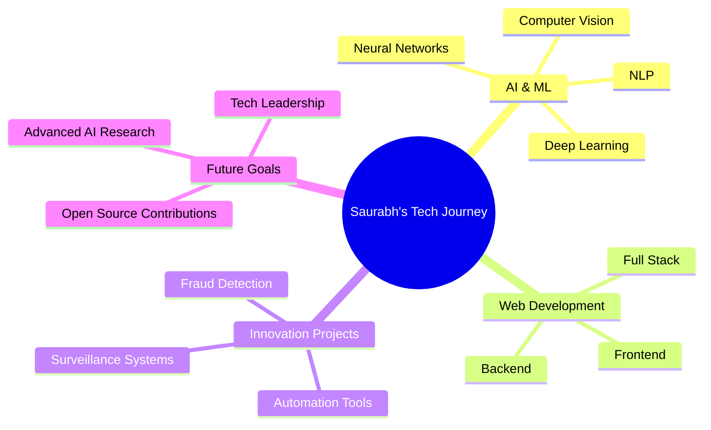

# 🚀 Saurabh Yadav
### AI Engineer | Software Developer | Tech Innovator

---

## 🌟 About Me

- 🔭 Currently working on **AI-powered surveillance systems** and **financial fraud detection**
- 🌱 Exploring advanced **Machine Learning** and **Computer Vision** technologies
- 💡 Passionate about creating solutions that make a real-world impact
- 🎯 Focused on **AI applications** in security and automation
- 📫 Reach me at: **[Your Email]**
- ⚡ Fun fact: I build AI systems that can see and think!

 

---

## 🛠️ Tech Stack

### Programming Languages

### AI/ML & Data Science

### Web Development

### Databases & Tools

---

## 🎯 Featured Projects

<table>
<tr>
<td width="50%">

### 🤖 AI Fraud Detection System

**Tech Stack:** Python, Machine Learning  
**Description:** AI-powered system for detecting suspicious financial transactions using advanced ML algorithms.

</td>
<td width="50%">

### 👁️ Surveillance AI

**Tech Stack:** Python, Computer Vision  
**Description:** Intelligent surveillance system with real-time object detection and behavior analysis.

</td>
</tr>
<tr>
<td width="50%">

### 🆔 ID Card Generator - SoET

**Tech Stack:** HTML, CSS, JavaScript  
**Live Demo:** [View Project](https://id-card-generator-page-for-so-et-vi.vercel.app)

</td>
<td width="50%">

### 🆔 ID Card Generator - ICS

**Tech Stack:** HTML, CSS, JavaScript  
**Live Demo:** [View Project](https://ics-id-card-generator-page.vercel.app)

</td>
</tr>
</table>

---

## 📊 GitHub Analytics

---

## 🏆 GitHub Trophies

---

## 📈 Contribution Graph

---

## 🎯 Current Focus Areas

---

## 🌐 Connect With Me

---

### 💫 "Innovation distinguishes between a leader and a follower." - Steve Jobs

---

**⭐ Star my repositories if you find them interesting!**

