<div align="center">

<!-- Animated Header -->


<!-- Animated Typing Text -->
<div align="center">
  
</div>

<!-- Animated Badges -->
<p align="center">
  
  
  
</p>

<!-- Animated Divider -->


</div>

---

## 🎯 About Me

<div align="center">

<table border="0">
<tr>
<td width="50%" valign="top">

### 👨‍💻 Profile Overview
```yaml
name: Saurabh Yadav
location: India 🇮🇳
role: AI Engineer & Software Developer
experience: Passionate Problem Solver
education: Computer Science Enthusiast
languages: [Python, JavaScript, HTML, CSS]
interests: [AI, ML, Web Dev, Innovation]
motto: "Code with Purpose, Innovate with Passion"
```

</td>
<td width="50%" valign="top">


</td>
</tr>
</table>

</div>

### 🚀 Current Focus

- 🔭 Building **AI-powered surveillance systems** and **fraud detection models**
- 🌱 Deep diving into **Computer Vision** and **Advanced ML Algorithms**
- 💡 Creating solutions that bridge **technology** and **real-world problems**
- 🎯 Developing **intelligent automation systems**
- 🌟 Contributing to **open-source AI projects**
- 📫 Connect: **saurabhyadav.dev@gmail.com** 

---

## 🛠️ Tech Arsenal

<div align="center">

### 💻 Programming Languages
<p>
  
  
  
  
</p>

### 🤖 AI/ML & Data Science
<p>
  
  
  
  
  
  
</p>

### 🌐 Web Development
<p>
  
  
  
  
</p>

### 🗄️ Databases & Cloud
<p>
  
  
  
</p>

### 🛠️ Tools & Platforms
<p>
  
  
  
  
</p>

</div>

---

## 🎯 Featured Projects

<div align="center">


<table>
<tr>
<td width="50%">
<h3 align="center">🤖 AI Fraud Detection System</h3>
<div align="center">
<a href="https://github.com/Saurabhyadavastro/AI-For-Flagging-Suspisious-Transactions" target="_blank">

</a>
</div>
<p align="center">


</p>
<p align="center">🔍 Advanced AI system for detecting suspicious financial transactions using machine learning algorithms and pattern recognition.</p>
</td>

<td width="50%">
<h3 align="center">👁️ Surveillance AI</h3>
<div align="center">
<a href="https://github.com/Saurabhyadavastro/surveillance-AI" target="_blank">

</a>
</div>
<p align="center">


</p>
<p align="center">🎯 Intelligent surveillance system with real-time object detection, behavior analysis, and automated alerting.</p>
</td>
</tr>

<tr>
<td width="50%">
<h3 align="center">🆔 SoET ID Card Generator</h3>
<div align="center">
<a href="https://github.com/Saurabhyadavastro/ID-Card-Generator-Page-For-SoET-Vikram-University" target="_blank">

</a>
</div>
<p align="center">


<a href="https://id-card-generator-page-for-so-et-vi.vercel.app" target="_blank">

</a>
</p>
<p align="center">💳 Professional ID card generation system for SoET Vikram University students with dynamic data processing.</p>
</td>

<td width="50%">
<h3 align="center">🆔 ICS ID Card Generator</h3>
<div align="center">
<a href="https://github.com/Saurabhyadavastro/ICS-ID-CARD-GENERATOR-PAGE" target="_blank">

</a>
</div>
<p align="center">


<a href="https://ics-id-card-generator-page.vercel.app" target="_blank">

</a>
</p>
<p align="center">🎓 Automated ID card generation solution for ICS Vikram University with responsive design and user-friendly interface.</p>
</td>
</tr>
</table>


</div>

---

## 📊 GitHub Analytics & Performance

<div align="center">

<!-- GitHub Stats Cards -->


<!-- Streak Stats -->


<!-- Activity Graph -->


</div>

---

## 🏆 Achievements & Recognition

<div align="center">

<!-- GitHub Trophies -->


<!-- Achievement Metrics -->
<table>
<tr>
<td align="center">

<br />
<sub><b>Active Repos</b></sub>
</td>
<td align="center">

<br />
<sub><b>Programming Languages</b></sub>
</td>
<td align="center">

<br />
<sub><b>Specialization</b></sub>
</td>
<td align="center">

<br />
<sub><b>Learning Journey</b></sub>
</td>
</tr>
</table>

</div>

---

## 🎯 Technology Roadmap & Goals

```mermaid
graph TD
    A[🎯 Current Focus] --> B[🤖 AI & Machine Learning]
    A --> C[💻 Full Stack Development]
    A --> D[🔧 Automation Systems]
    
    B --> B1[Computer Vision]
    B --> B2[Deep Learning]
    B --> B3[NLP Processing]
    
    C --> C1[Frontend Frameworks]
    C --> C2[Backend APIs]
    C --> C3[Database Design]
    
    D --> D1[Surveillance Systems]
    D --> D2[Fraud Detection]
    D --> D3[Smart Solutions]
    
    E[🚀 Future Goals] --> F[📚 Advanced AI Research]
    E --> G[🌟 Open Source Leadership]
    E --> H[🎓 Tech Mentorship]
    
    style A fill:#58A6FF,stroke:#1F6FEB,stroke-width:3px,color:#fff
    style E fill:#238636,stroke:#196C2E,stroke-width:3px,color:#fff
```

<div align="center">



</div>

---

## 🌟 Skills Matrix

<div align="center">

<table>
<tr>
<td valign="top" width="33%">

### 🤖 AI & Machine Learning
```text
Computer Vision         ████████████ 85%
Deep Learning          ██████████   75%
Machine Learning       ████████████ 88%
Data Analysis          ███████████  80%
Neural Networks        █████████    70%
```

</td>
<td valign="top" width="33%">

### 💻 Development
```text
Python Programming     ████████████ 90%
Web Development        ███████████  82%
JavaScript             ██████████   78%
Database Design        █████████    72%
API Development        ███████████  80%
```

</td>
<td valign="top" width="33%">

### 🚀 Innovation
```text
Problem Solving        ████████████ 95%
Creative Thinking      ███████████  85%
System Architecture    ██████████   75%
Project Management     █████████    70%
Technical Leadership   ████████     68%
```

</td>
</tr>
</table>

</div>

---

## 📈 Weekly Development Breakdown

<div align="center">

<!--START_SECTION:waka-->
```text
Python       8 hrs 32 mins   ████████████████▓░░░░   68.2%
JavaScript   2 hrs 15 mins   ████▓░░░░░░░░░░░░░░░░   18.1%
HTML/CSS     1 hr 8 mins     ██▒░░░░░░░░░░░░░░░░░░   9.1%
Documentation 35 mins        █▒░░░░░░░░░░░░░░░░░░░   4.6%
```
<!--END_SECTION:waka-->

</div>

---

## 🌐 Connect & Collaborate

<div align="center">

<table>
<tr>
<td align="center" width="50%">

### 📫 Get In Touch
<p>
<a href="mailto:saurabhyadav.dev@gmail.com">

</a>
<br />
<a href="https://linkedin.com/in/saurabhyadavastro">

</a>
<br />
<a href="https://twitter.com/saurabhyadavastro">

</a>
<br />
<a href="https://saurabhyadav.dev">

</a>
</p>

</td>
<td align="center" width="50%">

### 🤝 Let's Collaborate
<p>
🔭 Open to exciting AI/ML projects<br />
💡 Available for innovative collaborations<br />
🌱 Always learning and growing<br />
🎯 Passionate about solving real problems<br />
📚 Happy to mentor and share knowledge
</p>

</td>
</tr>
</table>

<!-- Animated Contact GIF -->
 <em><b>I love connecting with different people</b> so if you want to say <b>hi, I'll be happy to meet you more!</b> 😊</em>

</div>

---

<div align="center">

### 💭 Philosophy

> *"The best way to predict the future is to create it"* - Peter Drucker

**🚀 Always building, always learning, always innovating! 🚀**

<!-- Animated Footer -->


<!-- Visitor Badge -->


**⭐ Star my repositories if you find them interesting! ⭐**

</div>
